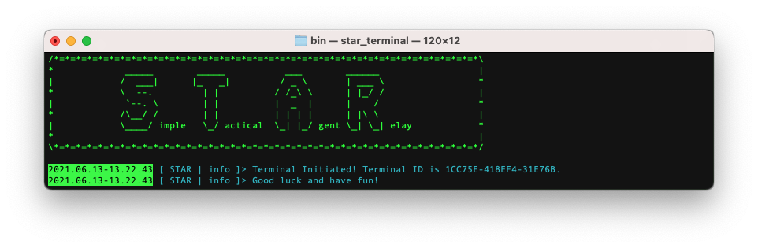
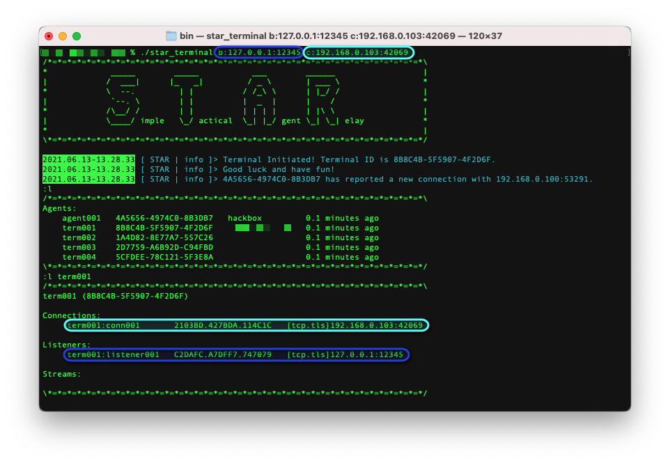
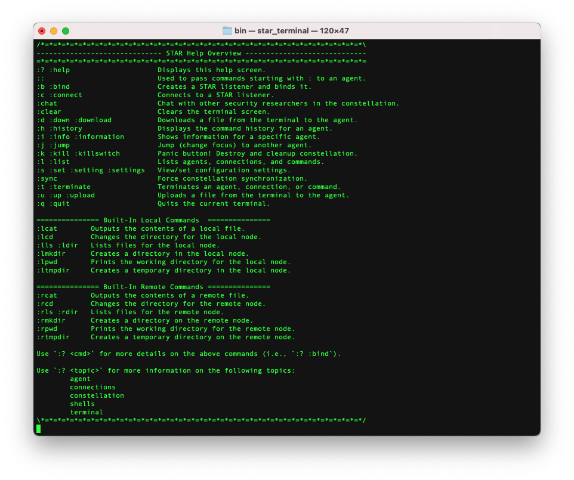

 

# **S**imple **T**actical **A**gent **R**elay (**S.T.A.R.**)

S.T.A.R. is intended as a post-exploitation framework for ethical hackers and security researchers. It serves as a sort of peer-to-peer C2, and can be used in environments with no/partial internet access.

The inspiration for the tool is due to the author working on HackTheBox's Dante ProLab and not liking the "feel" of existing C2/pivoting tools that were attempted. S.T.A.R. is made more for the author's needs/wants than anything else, but if anyone else can find benefit from it, all the better.

## Installation

1. _It is assumed that you already have the latest version of golang installed on your machine._
1. Clone the repository to your local machine with `git clone https://github.com/CyberSecurityN00b/star.git`
1. Search for `SECURITY RESEARCHER TODO` in the code for per-engagement recommendations
1. From within the repository, run `./build-star.sh`
    1. If you get `build command-line-arguments: cannot load embed: malformed module path "embed"` as an error message, run `go version` in the repository directory to ensure that it is using the correct version of go, which is 1.16+.
1. You should now have a batch of agents (in `./bin/agents/`) and terminals (in `./bin/terminals/`); additionally, you will have a terminal compiled for your local machine at `./bin/star_terminal`.

For each new engagement, you should update the respository and re-run `./build-star.sh`. It is highly discouraged to use the same binaries between engagements. Node development is such that constants should not be expected to be the same between updates and a new SSL/TLS cert is generated each time as well.

<b>Note: Only terminals and agents from the same build will be able to connect to each other.</b>

## Concepts and Terminology

| Term | Definition |
| --- | --- |
| **Agent** | An agent is a node that is placed on a remote computer for post-exploitaiton purposes. Agents should only be placed on computers where RCE is intended. If RCE is not intended, use a terminal instead.  An example agent reading-friendly identifier is `agent001`.|
| **Connection** | A connection is an existing link between S.T.A.R. nodes or, in the case of fileservers and shells, an external 3rd party.  An example connection reading-friendly identifier is `agent001:conn001`.|
| **Constellation** | A collection of interconnected agent/terminal nodes. Best practice is to create a separate constellation per engagement. |
| **FileServer** | A S.T.A.R. fileserver allows for an agent to serve a file that is located elsewhere within the constellation. The file is not transferred until the request is made, and is not saved to the agent's local file system. |
| **Listener** | A listener is an open port waiting for one or more connections. These may be S.T.A.R. connections, shell connections, or requests to fileservers.  An example listener reading-friendly identifier is `agent001:listener001`.|
| **Node** | A node is either an agent or terminal that is part of the S.T.A.R. constellation. |
| **Shell** | Shells allow for a remote computer to connect to the constellation using netcat or similar. These are useful where a S.T.A.R. node is not appropriate for the device or the security researcher has not yet attained post-exploitation status on the device. Note: Shells only allow the security researcher to run commands on the device, S.T.A.R. commands do not work with shells.|
| **Stream** | A stream is used for I/O within the constellation. Streams are used by shells, fileservers, and RCE commands.  An example stream reading-friendly identifier is `agent001:stream001`.|
| **Terminal** | A terminal is a node that is used to interact with agents in the constellation. A terminal should be used instead of an agent where RCE is not intend, such as a proxy point controlled by the security researcher.  An example terminal reading-friendly identifier is `term001`. <i>Note: Connection, listener, and stream identifiers for other terminals will not be visible to your terminal. This is by design.</i>|

## Using

Use a terminal on the security researcher's computer to interact with the constellation. Run agents on remote machines or any machine where RCE is acceptable.

Agents can be configured with hard-coded connection instructions, either to create a listener or attempt a connection, when run. At the time of this writing, agents will listen on port `42069` by default.

When either agents or terminals are run, connection instructions can be passed as command-line arguments for either creating listeners or attempting connections. Some examples:
* **`star_agent b:12345`** - Creates a listener bound on port `12345`
* **`star_agent b:10.10.10.10:1111`** - Creates a listener bound on port `1111` of the interface with an IPv4 address of `10.10.10.10`
* **`star_agent c:www.example.com:8080`** - Attempts to connect to a S.T.A.R. node listening on port `8080` of `www.example.com`.

All of the above commands can be combined, i.e.: `star_agent b:12345 b:10.10.10.10:111 c:www.example.com:8080`. In this instance, the agent will attempt all specified listeners and connections, in addition to the hard-coded ones.

## Commands

S.T.A.R. Commands:
| Commands | Description |
| --- | --- |
| :? :help |  Displays generic or cmd specific help. |
| :: | Passes on text to the focused agent. Only really useful when passing text that starts with a ':'. |
| :b :bind | Creates a S.T.A.R. node listener and binds it to a port. |
| :c :connect | Connects to a S.T.A.R. node listener. |
| :clear | Clears the terminal screen, cause apparently some people are into that. |
| :chat | Communicate with other security researchers in the constellation. |
| :d :down :download | Downloads a file from the agent to the terminal. |
| :h :history | Displays the command/chat history. |
| :i :info  | Shows information for a specific agent. |
| :j :jump | Changes focus (or "jumps to") another agent or stream. |
| :k :kill :killswitch | Panic button! Destroy and cleans up constellation. _Note: Will not be fully implemented until development is complete._ |
| :l :list | Lists agents, connections, and streams (commands). |
| :pf :portforward | Port forwarding. |
| :s :set :setting :settings | View/set configuration settings. |
| :sync | Forces constellation synchronization. |
| :t :terminate | Terminate an agent, connection, or stream (command). |
| :u :up :upload | Uploads a file from the terminal to the agent. |
| :q :quit | Quits the current terminal. |

Built-In Local Commands:
| Commands | Description |
| --- | --- |
| :lcat | Outputs the contents of a local file. |
| :lcd | Changes the directory for the local terminal. |
| :lls :ldir | Lists the files in the local terminal's working directory. |
| :lmkdir | Creates a directory locally and changes the terminal's working directory to it. |
| :lpwd | Prints the local terminal's working directory. |
| :ltmpdir | Creates a temporary directory locally and changes the terminal's working directory to it. |

Built-In Remote Commands:
| Commands | Description |
| --- | --- |
| :rcat | Outputs the contents of a remote file. |
| :rcd | Changes the directory for the remote agent. |
| :rls :rdir | Lists the files in the remote agent's working directory. |
| :rmkdir | Creates a directory remotely and changes the agent's working directory to it. |
| :rpwd | Prints the remote agents's working directory. |
| :rtmpdir | Creates a temporary directory remotely and changes the agents's working directory to it. |

## Special Thanks

### Contributors

 - [Shimstache](https://github.com/Shimstache) - Brainstorming, discussing, testing, and providing feedback.
 - [TheeNawMan](https://github.com/TheeNawMan) - Brainstorming and discussing.

### GitHub Sponsors - VIP

 - None as of yet!

### GitHub Sponsors

 - None as of yet!

## Misc.

### Artwork

The Star Tarot artwork at the top of this page and under `./imgs` was commissioned from a provider on Fiverr who is no longer active on the service. It may be used freely in material which is promoting the S.T.A.R. project.

### Legal*ish*

This tool is intended for ethical hackers and security researchers. The author is not responsible for any negative impact, intentional or otherwise, made through the use of this tool.

### Future Development

Once all currently planned features are implemented, development of this tool by the author will be limited to maintenance, bug fixes, and security issues. New features are not at all likely to be implemented; feature requests in the nature of exploitation, enumeration, etc. will not be entertained. The exception to this _may_ be SOCKS5 proxy implementation, but man am I tired of that right now.
